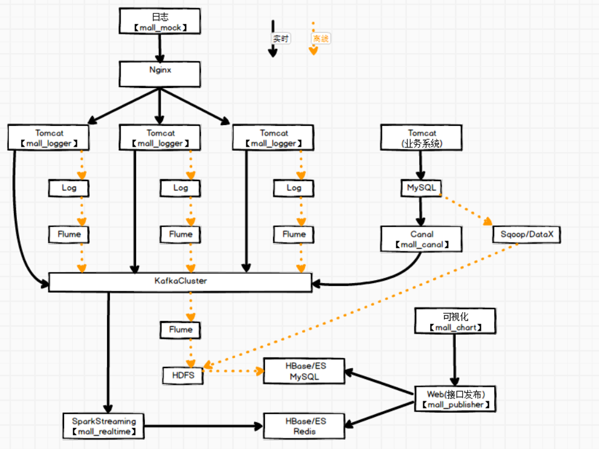

# sparkStreaming 实战
## 架构

## 需求
- 当日用户首次登录 （[日活](mall_realtime/src/main/scala/realtime/application/AlertApp.scala)） 分时趋势图，昨日对比
- 当日新增用户及分时趋势图，昨日对比
- 当日[交易额](mall_realtime/src/main/scala/realtime/application/OrderApp.scala)及分时趋势图，昨日对比
- 当日订单数及分时趋势图，昨日对比
- [购物券功能风险预警](mall_realtime/src/main/scala/realtime/application/AlertApp.scala)
- 用户购买明细灵活分析功能
## 模块说明
|模块名|说明|
|:---|:---|
|mall_common|公用模块，存放项目使用的常量|
|mall_logger|日志采集模块|
|mall_mock|模拟日志生成模块|
|[mall_publisher](mall_publisher/mall_publisher.md)|灵活查询数据接口模块|
|mall_realtime|实时处理模块|
|mall_canal|canal客户端，用于同步业务数据库中的数据|

## 技术点

- [读取日志服务器日志并导入Kafka](mall_logger/src/main/java/o/dh/mall_logger/controller/LoggerController.java)
- [双流Join](mall_realtime/src/main/scala/realtime/application/SaleApp.scala)
- [读取Kafka中数据（kafka自动提交偏移量）](mall_realtime/src/main/scala/realtime/util/MyKafkaUtil.scala)
- [Canal监控MySQL数据，并导入Kafka](mall_canal/src/main/java/canal/client/CanalClient.java)